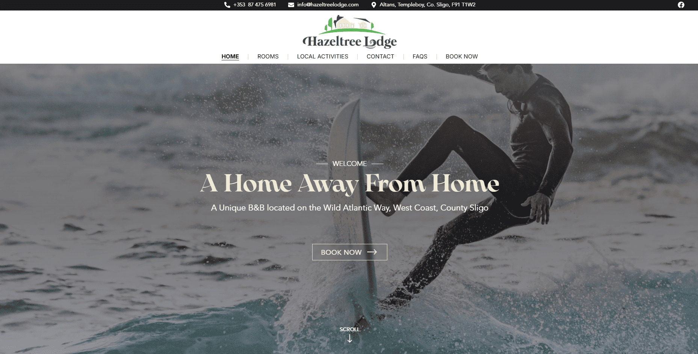
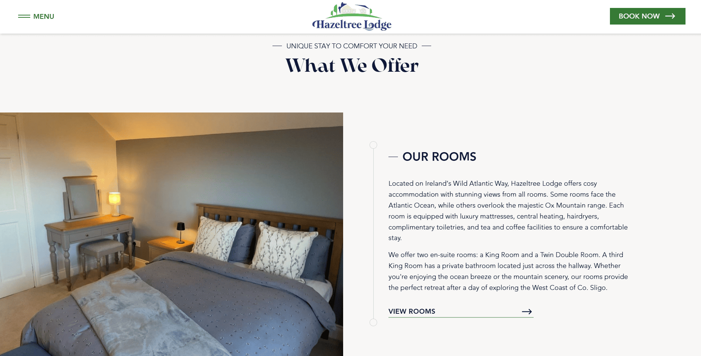
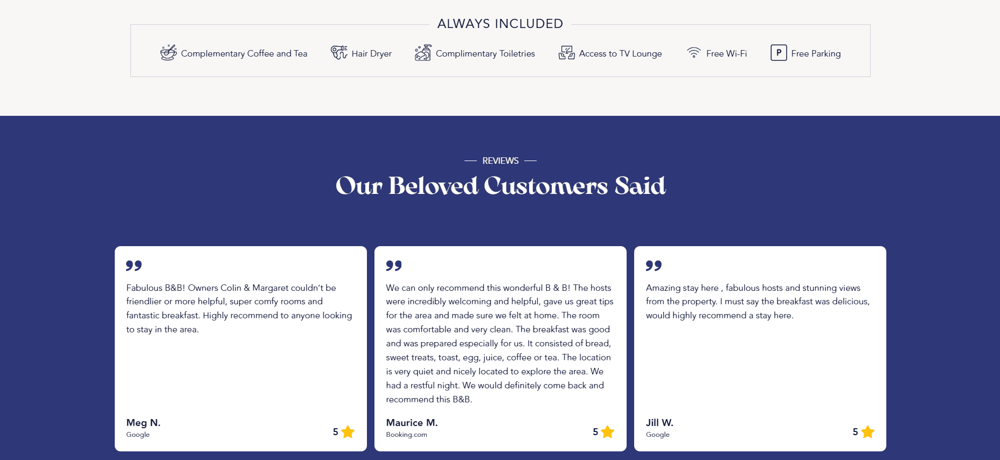
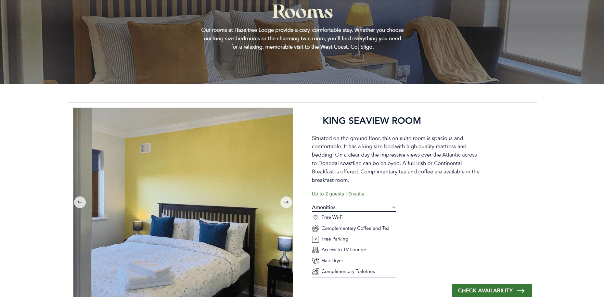
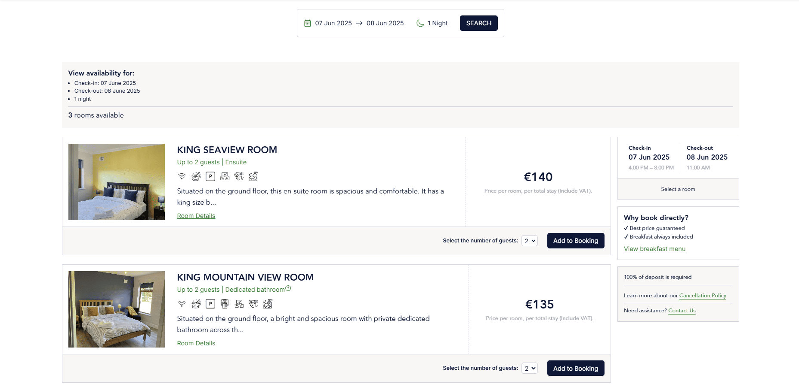

# Hazeltree Lodge B&B Website

> **A Next.js App Router project for an Irish Bed-and-Breakfast, providing real-time room availability, secure payments, and easy content management.**

[Official Website](https://www.hazeltreelodge.com/)



## Table of Contents
- [Overview](#overview)
- [Features](#features)
- [Screenshots](#screenshots)
- [Tech Stack](#tech-stack)
- [Installation & Setup](#installation--setup)
- [Usage](#usage)
- [License](#license)
- [Contact](#contact)

---

## Overview
Hazeltree Lodge is a cozy bed-and-breakfast located in Sligo, Ireland. This repository contains the full source code for the website. It handles:
- Real-time availability, pricing and pricing and automated emails from **Beds24**,
- Secure payments via **Stripe**,
- Customizable content through **Contentful**,
- A modern front-end built with **Next.js**, **Tailwind CSS**, and **Framer Motion**.

The result is a user-friendly booking experience that the B&B owners can maintain themselves without extensive technical knowledge.

---

## Features

1. **Room Availability & Booking**  
   Integrates with **Beds24** to display up-to-date room info, including rates and vacancy. Guests select dates and room types, then proceed to checkout.

2. **Secure Payments**  
   **Stripe** handles credit card transactions, with a straightforward checkout flow.

3. **CMS-Driven Content**  
   **Contentful** allows staff to easily edit images, text, local activity info, and FAQ content, all without redeploying the site.

4. **Automated Emails**  
   **Beds24** triggers confirmation messages for both guests and staff.

5. **Easy Inquiry**  
   **EmailJS** triggers inquiry messages.

6. **Modern Design & Animations**  
   **Tailwind CSS** for quick, responsive styling, and **Framer Motion** for smooth transitions.

7. **Checkout & Confirmation**  
   A clear flow guides users from room selection to final confirmation, ensuring all relevant details are saved.

---

## Screenshots

**Homepage**  





**Rooms**  


**Booking**  


To see more, please visit the [Official Website](https://www.hazeltreelodge.com/) or the project details on my portfolio [here](https://www.emanuelesgroi.com/portfolio/hazeltree-lodge-b-and-b)

---

## Tech Stack

- **Next.js (App Router)** – Server-side rendering, optimized routing.
- **Tailwind CSS** – Utility-first framework for rapid styling.
- **Framer Motion** – Adds smooth, modern animations.
- **Stripe** – Secure payment integration for credit cards.
- **Beds24** – Real-time management of room availability and pricing.
- **Contentful** – Headless CMS for site text and media.
- **EmailJS** – Handles automated emails without a dedicated backend.

---

## Installation & Setup

To set up the project locally, follow these steps:

1. **Clone the repository**:

   ```bash
   git clone [https://github.com/Emanuele-Sgroi/hazeltree-lodge-website.git](https://github.com/Emanuele-Sgroi/hazeltree-lodge-website.git)
   ```

2. **Navigate to the project directory**:

   ```bash
   cd hazeltree-lodge-website
   ```

3. **Install dependencies**:

   ```bash
   npm install
   ```

4. **Create an `.env.local` or `.env.production` file** in the root directory and add the required API keys and environment variables. Below is an example of what the `.env` file should contain:

   ```env
   CONTENTFUL_SPACE_ID=xxxxxxxxxx
   CONTENTFUL_ACCESS_TOKEN=xxxxxxxxxxx
   CONTENTFUL_PREVIEW_TOKEN=xxxxxxxxxxx

   NEXT_PUBLIC_EMAILJS_SERVICE_ID=xxxxxxxxxx
   NEXT_PUBLIC_EMAILJS_TEMPLATE_ID=xxxxxxxxxx
   NEXT_PUBLIC_EMAILJS_PUBLIC_KEY=xxxxxxxxxx

   NEXT_PUBLIC_BEDS24_REFRESH_TOKEN=xxxxxxxxxxxxxxxxx

   NEXT_PUBLIC_STRIPE_TEST_PUBLISHABLE_KEY=xxxxxxxxxxxxxxxxxxxxx
   STRIPE_TEST_SECRET_KEY=xxxxxxxxxxxxxxx

   NEXT_PUBLIC_STRIPE_PUBLISHABLE_KEY=xxxxxxxxxxxxx
   STRIPE_SECRET_KEY=xxxxxxxxxxxx

   SITE_URL=your URL
   ```

## Usage

To use the project:

- After setting up the `.env` file with the correct API keys and configurations, run the following command to start the project locally:

  ```bash
  npm run dev
  ```

- Sing up in Contentful, create the project and the relative data fields.


---

## License

This codebase is provided under a custom license. While the project’s intellectual property (including the Hazeltree Lodge name and branding) remains owned by the B&B owners, the underlying code is publicly accessible for educational or reuse purposes.

If you wish to reuse or adapt this code:
- Remove all references to Hazeltree Lodge or its associated branding.
- Provide credit to the original developer (e.g., mention in your README).

For any questions regarding usage or licensing, please contact me directly.

## Contact

You can contact me here:
- Email: em.sgroi@gmail.com
- My Website: [www.emanuelesgroi.com](https://www.emanuelesgroi.com/)
